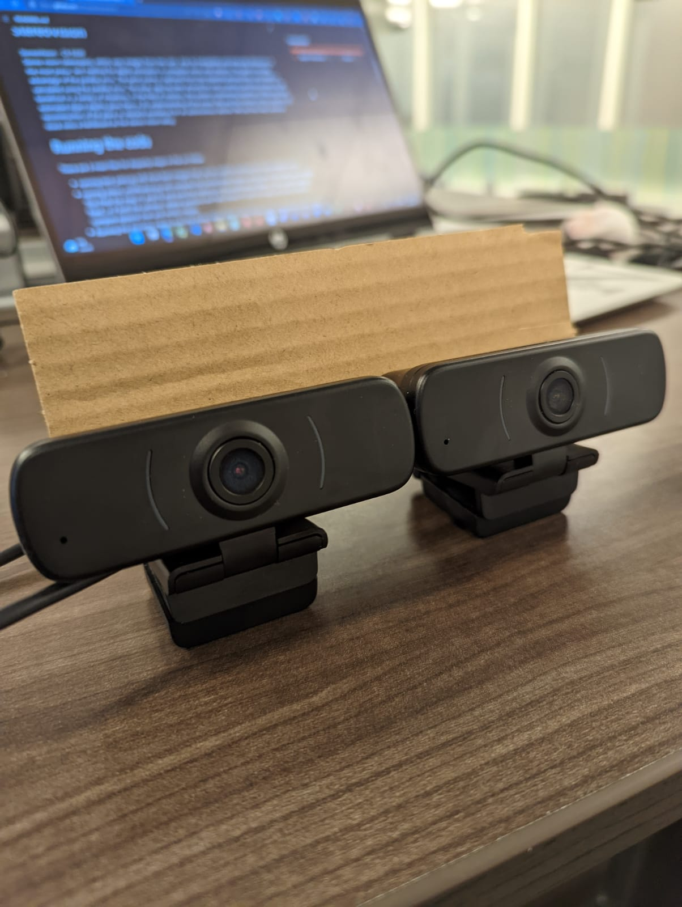
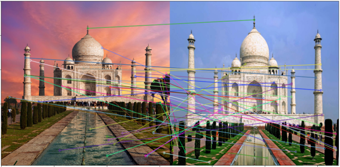
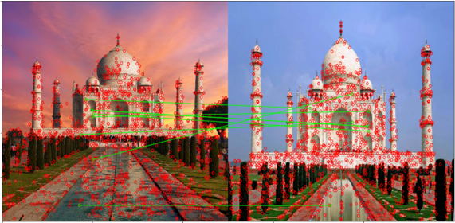
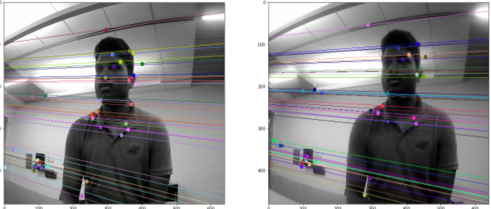
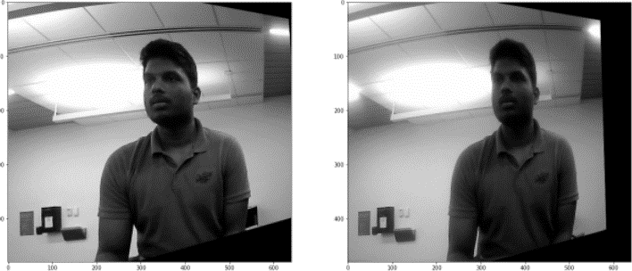
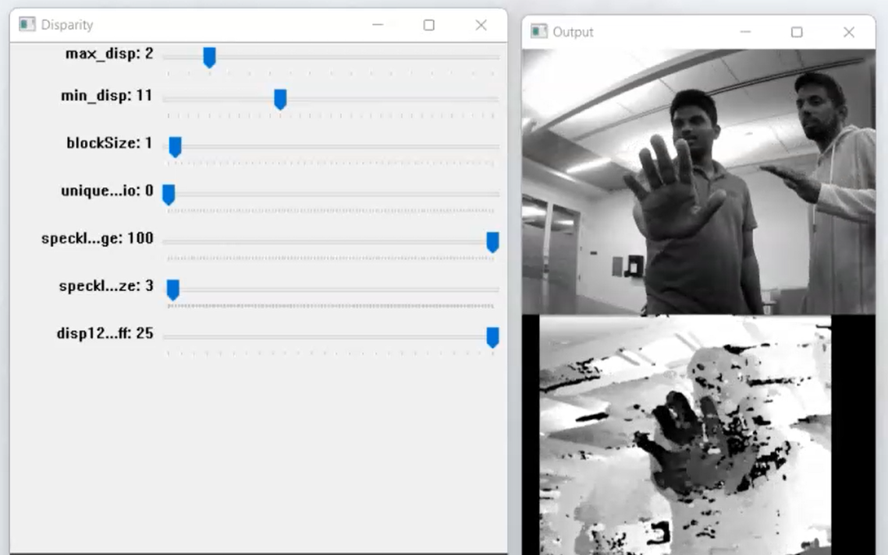
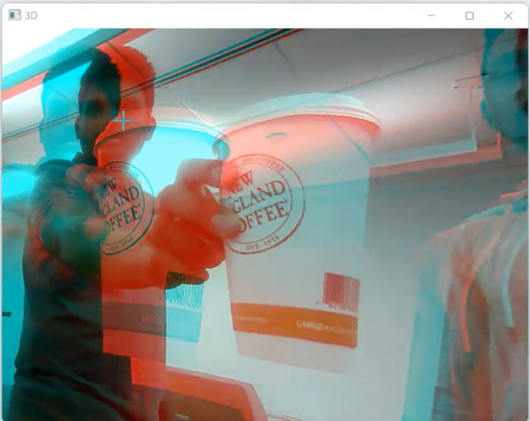

# StereoVision
Members : Santosh Vasa, Ashwin Unnikrishnan  
StereoVision - CS 5330  
Output Video : https://drive.google.com/file/d/1azJNqO1aE3_qDoztdDluYG7ZoKzPKBHz/view?usp=sharing  
Presentation : https://drive.google.com/drive/folders/1qs1g-1bnzGAeCW-CLQr7FQ9Sj0NwnsX2?usp=sharing  
# INTRODUCTION 
Depth map data is used in a variety of applications, including object avoidance, 3D reconstruction, localization, and more. 
This is possible with a stereo setup of two cameras. Lidars and radars can be used to create depth maps, but they are 
expensive pieces of equipment. To retrieve different views, stereovision employs two horizontally (or arbitrarily) displaced 
cameras. The disparity between the two image views allows us to estimate the depth of the image at each pixel location.
# COMPUTATIONAL PERSPECTIVE: 
- Uncalibrated Stereo: Although the intrinsic parameters of each camera are known in uncalibrated stereo setups, the 
extrinsic parameters relative to both cameras are unknown. These extrinsic parameters are needed for the 3D –
construction of the scene (3d point cloud). To calibrate the setup, we will need to compute the following. 

- Good features to track: To compute the fundamental matrix, we will need at least 8 good features that match both images 
taken from each camera. Using SIFT or SURF features can provide good results without the aperture problem. We use the 
RANSAC algorithm to reduce the number of bad matches by removing the outliers. We will investigate more algorithms 
in this space and try out the state of the art algorithms.  

- Fundamental Matrix: The fundamental matrix can map a pixel location in the left image to a line segment in the right 
image based on the epipolar constraint. There are eight unknown parameters in this matrix. Using 8 feature detection 
points, such as those provided by SIFT, we can obtain 8 equations for solving the fundamental matrix. 

- Template Matching: We can find the depth correspondence or registration of all the matching points in the images using 
template matching. We will investigate the most efficient and accurate methods of accomplishing this. The disparity map 
of the scene, which can be used to estimate the depth map, is formed by the corresponding points between two images. 

- Triangulation: We must find the 3-dimensional coordinates of the points in either the left or right camera coordinate 
system using the intrinsic parameters of both cameras. This is the inverse of project 4, in which we projected 3D points 
onto the 2D image plane. Using the intrinsic and relative extrinsic parameters, we can find four equations with three 
unknowns that can project two-dimensional points into three dimensions. This whole process lets us map arbitrary views 
to depth maps of the scene.  

# Running the code
There are 3 main files for disparity maps in the src folder. 
- running best_pairs.py will store 
best images that can be used for finding the fundamental matrix.
- running stereo_rectification.py will compute the fundamental 
matrix using one of the best_pair images. This finds the map
H1 and H2 and save the matrices in the rectification folder. 
If the camera setup is fixed, i.e if both the cameras' relative 
positons are fixed, these H1 and H2 maps are all we need to 
compute epipolar lines and rectify images.
- Running the disparity_map.py runs the stereo setup with H1.npy
H2.npy as the mapping function and shows the disparity_map.
- To run the 3D output, use the notebook 3D_Video.ipynb.
- To run calibrated stereo, use the notebook SimpleStereo.ipynb.
# Our Setup

# Output Results
## SIFT features

## FLANN Matching

## Epipolar lines

## Stereo Rectification

## Disparity Map

## 3D Video

 
